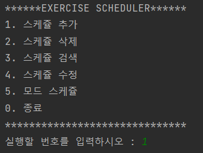
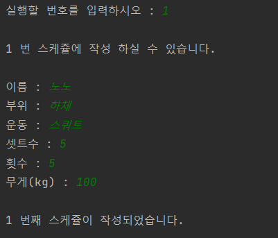
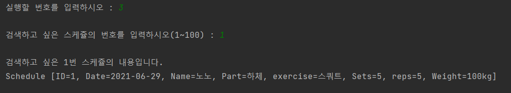
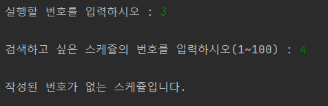
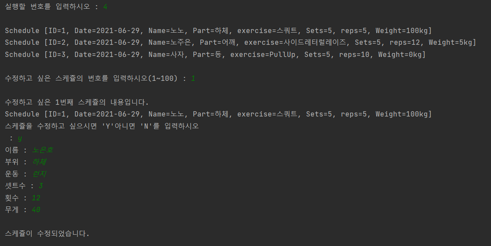
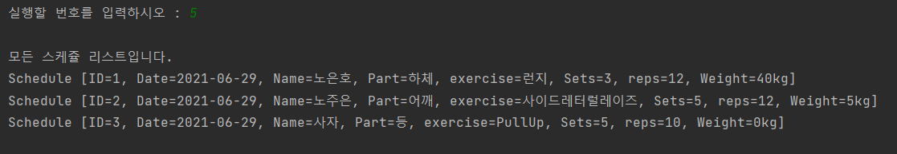
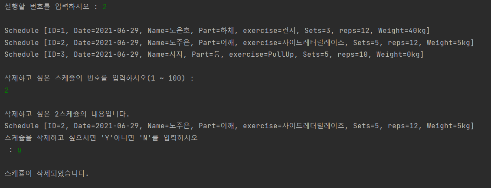
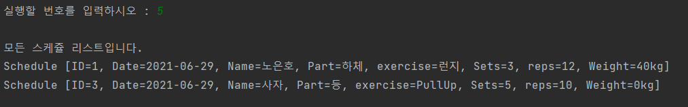
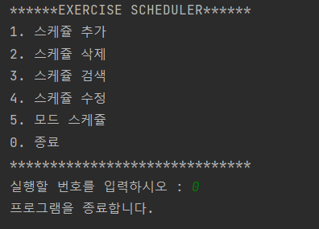

# JavaProjectAndroid
# Exercise Scheduler
1. Menu

   
2. 스케쥴 추가
   
   
3. 스케쥴 검색
   
   
   - 번호가 없는 스케쥴을 검색했을때
     
     
4. 스케쥴 수정
   
   
5. 모든 스케쥴 조회
   
   
6. 스케쥴 삭제
   
   
   - 다시 모든 스케쥴을 조회하면 삭제한 스케쥴이 없는 것을 확인 가능
     
     
7. 프로그램 종료
   
   
     
